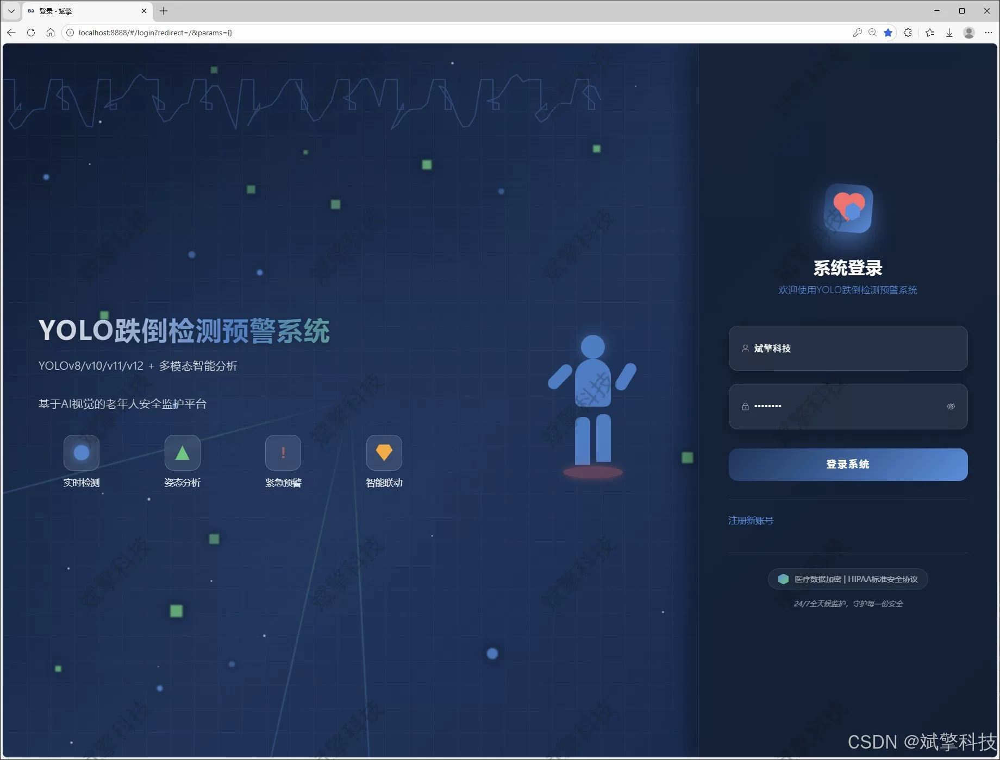
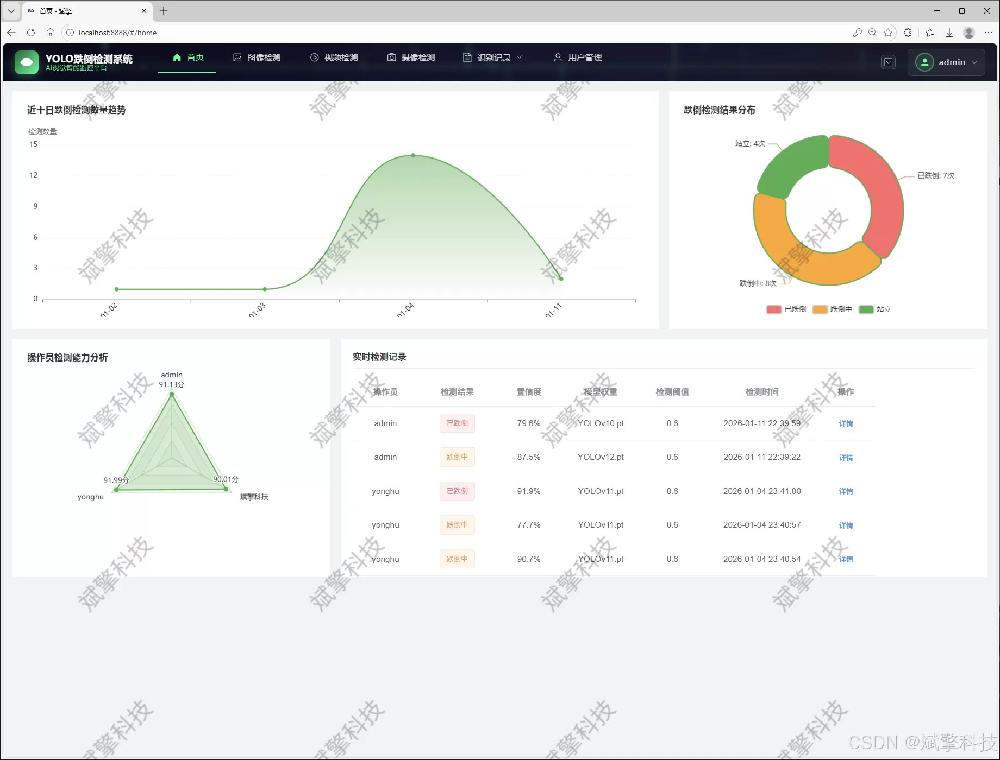
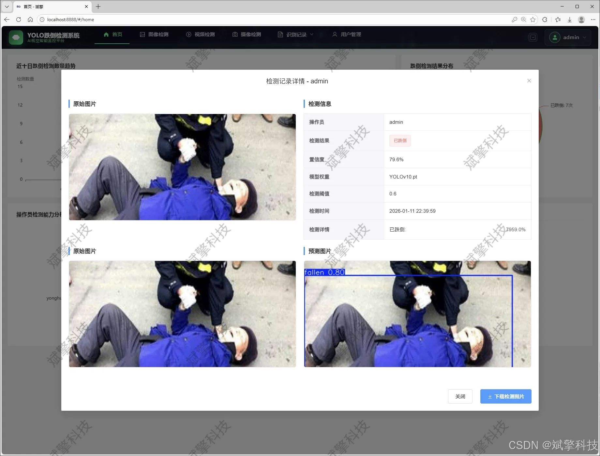
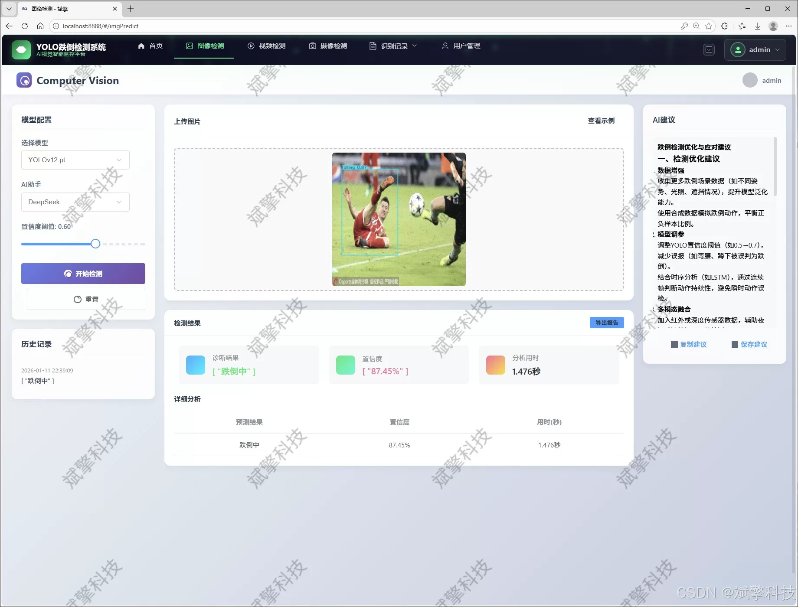
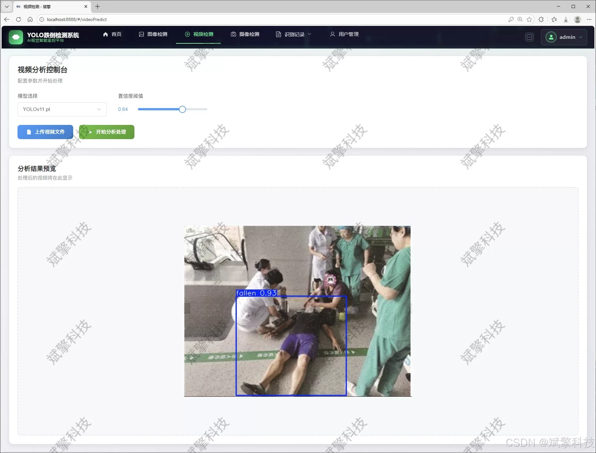
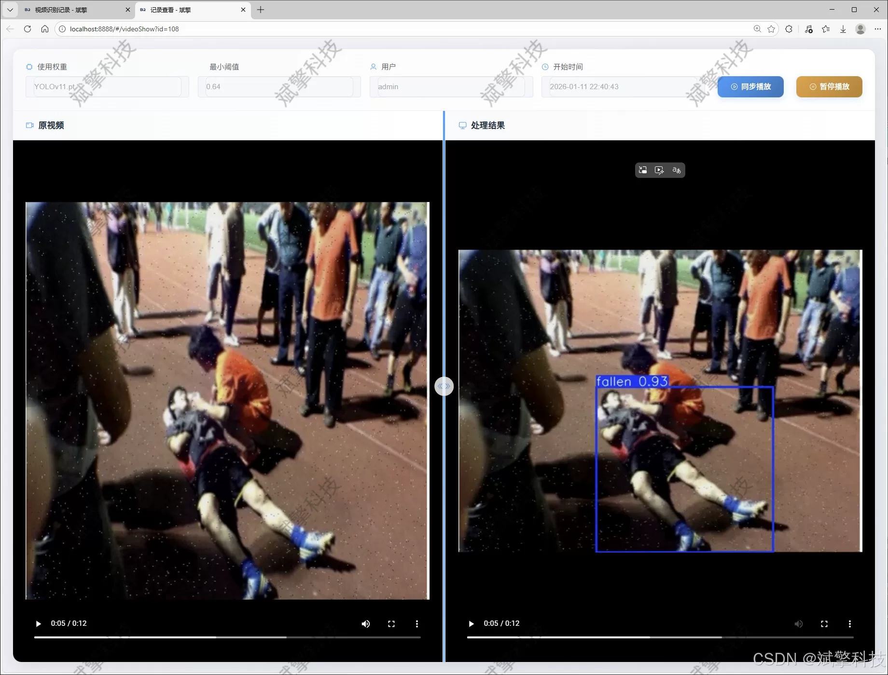
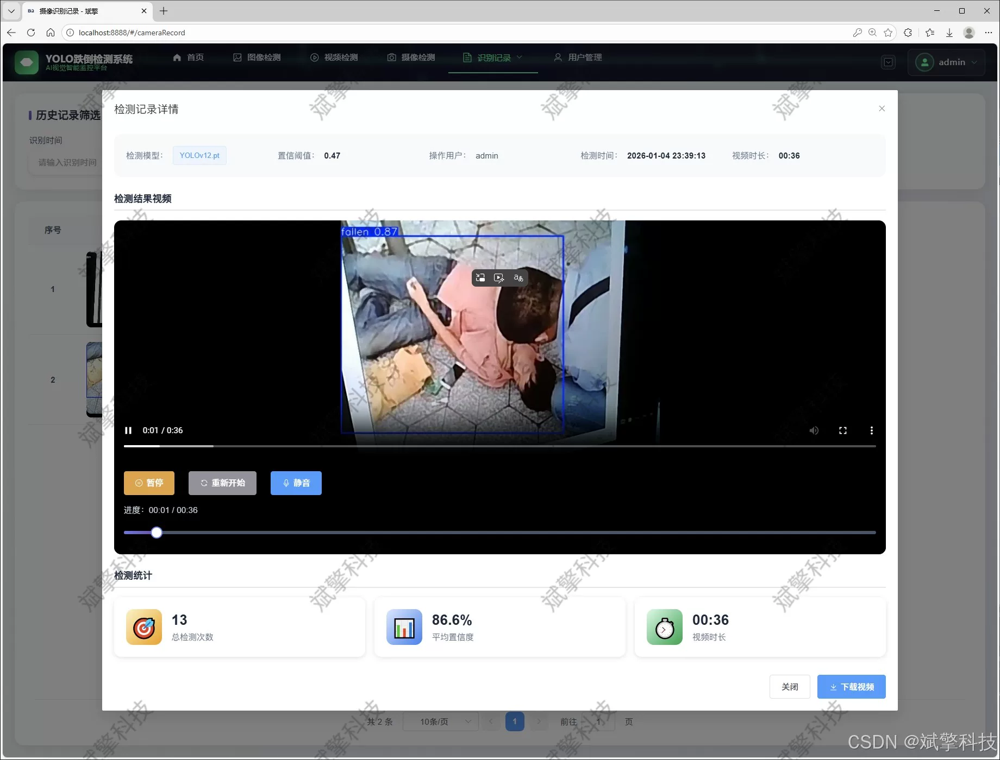
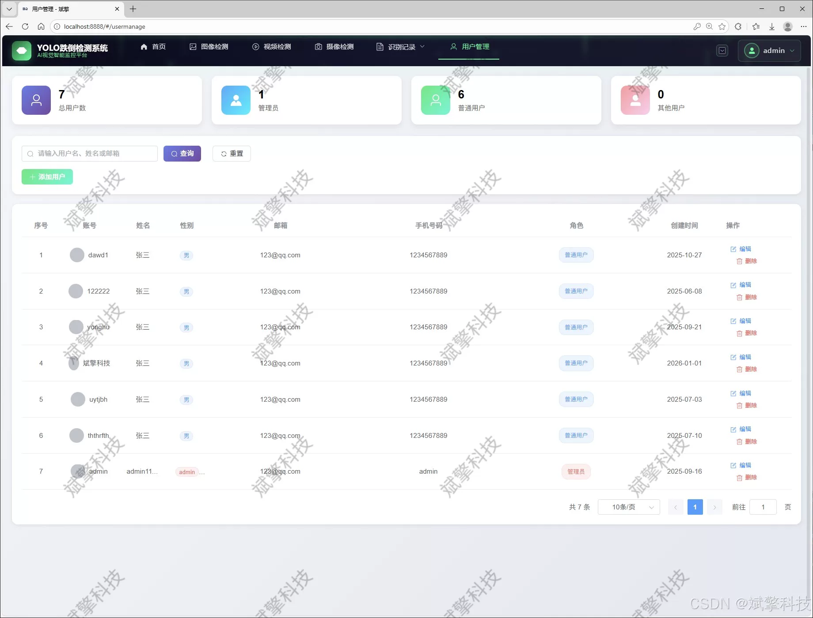
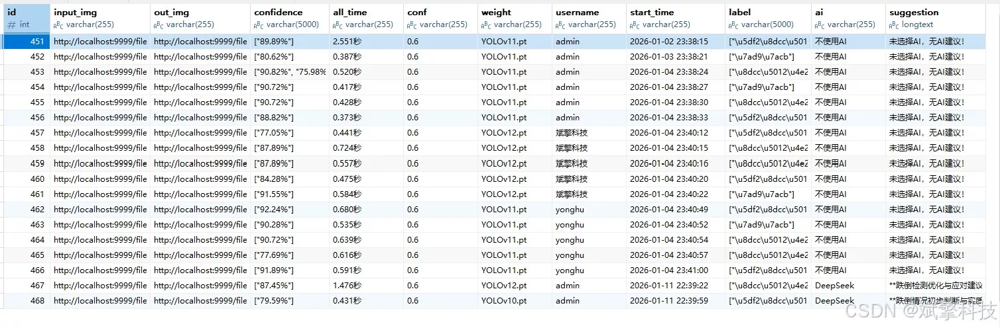

# YOLO+Large Model Fall Detection System

## Body

The YOLO+ large model falls detection system is based on the YOLO deep learning and the big models of Qianwen and DeepSeek. The system includes the intelligent analysis of DeepSeek, a web interface, a separation between frontend and backend, YOLO data, and YOLOv8/YOLOv10/YOLOv11/YOLOv12.

With the acceleration of global aging society, the risk of falls in daily life for the elderly is increasing. Timely and accurate detection of falls events has significant social significance for ensuring their safety and health. Traditional monitoring or wearable devices have limitations such as privacy invasion, poor user experience, or high false alarm rates. Therefore, this project integrates current cutting-edge computer vision technology with modern Web development architecture to build a comprehensive solution that includes intelligent analysis, real-time monitoring, data management, and remote interaction.

The core detection engine of the system adopts the performance-advanced YOLO series object detection algorithm, and innovatively integrates four latest versions of YOLOv8, YOLOv10, YOLOv11, and YOLOv12. This provides users with flexible and comparable algorithm choices to meet different precision and speed requirements. The model is trained and validated on a carefully labeled custom dataset, which includes three key categories: 'fallen' (has fallen), 'falling' (is falling), and 'stand' (standing/normal).

The system's backend is built using the SpringBoot framework, achieving a modern architecture of separation between frontend and backend. This ensures high cohesion, low coupling, and scalability of the system. The frontend provides an intuitive Web interaction interface, allowing users to easily access all features through their browser. Core functional modules include: user login and registration, multimodal detection channels (supporting image upload detection, video file analysis, and real-time video stream detection from cameras), and comprehensive AI intelligent analysis capabilities.

Functional module

✅ User Login and Registration: Supports password detection, saves to MySQL database.

✅ Supports four YOLO model switches, YOLOv8, YOLOv10, YOLOv11, YOLOv12.

✅ Information Visualization, Data Visualization.

✅ Image detection supports AI analysis functions, deepseek and Qianwen.

✅ Supports image detection, video detection, and real-time camera detection. The results are saved to a MySQL database.

✅ Picture recognition record management, video recognition record management and camera recognition record management.

✅ User Management Module, administrators can add, delete, modify, and query users.

✅ Personal center, can modify their own information, password name profile picture and so on.

There is no Lunwen writing service, nor any Lunwen.

## Images

## Payment

Here is a pay link on Stripe ( https://buy.stripe.com/3cs8yP7sY87d0vu9AB ). Please contact me lonlonago@foxmail.com after funding $89, and I will send you a complete data files , thank you!

